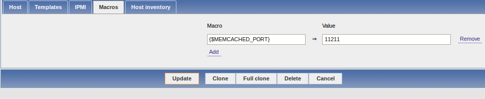

memcached_zabbix
================

Zabbix template for memcached instance

## Description

This is a template to monitor memcached instance.

You can monitor your memcached instance as every port as you have.

## Installation

You should import zbx_export_templates_memcached.xml template in your zabbix.

Deploy each memcached script in your zabbix script directory (in this git repository /etc/zabbix/script.d)

Make sure that these scripts have executable right.

In your memcached host, you should add {$MEMCACHED_PORT} variable in macro of the host parameter.

